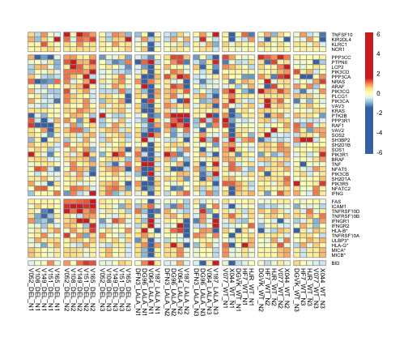
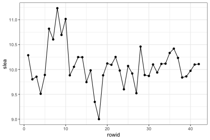

Load packages

```r
suppressPackageStartupMessages(library(package = "knitr"))
suppressPackageStartupMessages(library(package = "EDASeq"))
suppressPackageStartupMessages(library(package = "edgeR"))
suppressPackageStartupMessages(library(package = "readxl"))
suppressPackageStartupMessages(library(package = "GSEABase"))
suppressPackageStartupMessages(library(package = "biomaRt"))
suppressPackageStartupMessages(library(package = "pheatmap"))
suppressPackageStartupMessages(library(package = "tidyverse"))
```

Set session options

```r
workDir <- dirname(getwd())
opts_chunk$set(tidy = FALSE, fig.path = "../figure/")
options(readr.num_columns = 0,
        stringsAsFactors  = FALSE)
```

Read raw counts

```r
seqFile <- file.path(workDir, "input/vrc07.counts.csv")
countMat <- read_csv(file = seqFile) %>%
  as.data.frame() %>%
  column_to_rownames(var = "gene_id") %>%
  as.matrix()
cat("First five rows/columns of count matrix")
```

```
## First five rows/columns of count matrix
```

```r
print(countMat[1:5, 1:5])
```

```
##                    DFN3_LALA_B1 DFN3_LALA_B2 DFN3_LALA_B3 DFN3_LALA_D1
## ENSMMUG00000000001          134           70          155           58
## ENSMMUG00000000002           11            1            8            9
## ENSMMUG00000000005          180          106          472          512
## ENSMMUG00000000006            3            7            0            8
## ENSMMUG00000000007           24            9           72            3
##                    DFN3_LALA_D2
## ENSMMUG00000000001           47
## ENSMMUG00000000002           30
## ENSMMUG00000000005          859
## ENSMMUG00000000006            1
## ENSMMUG00000000007            8
```

```r
cat("\nDimensions of the count matrix")
```

```
## 
## Dimensions of the count matrix
```

```r
print(dim(countMat))
```

```
## [1] 32386   218
```

Read sample annotation

```r
sampleAnnotFile <- file.path(workDir, "input/Mangai_091918.xlsx")
# read full sheet
sampleAnnot <- read_excel(path      = sampleAnnotFile,
                            sheet     = 4)
# remove empty column
flag <- colMeans(is.na(sampleAnnot))
sampleAnnot <- sampleAnnot[, flag < 1]
# get subset
sampleAnnot <- sampleAnnot %>%
  mutate(Subset = gsub(pattern = "\r|\n",
                       replacement = " ",
                       `Sample Name`),
         Subset = gsub(pattern = ".+ ([^ ]+) cell.+",
                       replacement = "\\1",
                       Subset),
         Subset = gsub(pattern = ".+ ([^ ]+) +[0-9]+$",
                       replacement = "\\1",
                       Subset)) %>%
  # correct typos
  mutate(Subset = gsub(pattern    = "s$",
		       replacement = "",
		       Subset),
	 Subset = ifelse(test = Subset %in% "DC2l",
			 yes  = "DC2",
			 no   = Subset),
	 Subset = ifelse(test = Subset %in% "neutrophil",
			 yes  = "Neutrophil",
			 no   = Subset))
# get timepoint
sampleAnnot <- sampleAnnot %>%
  mutate(Timepoint = gsub(pattern   = ".+(-48h|-30 min|1 h|1h|Day 3).+",
                          replacement = "\\1",
                          `Sample Name`),
         Timepoint = gsub(pattern = " ",
                          replacement = "",
                          Timepoint))
# set rowname of sample annotation
sampleAnnot <- as.data.frame(sampleAnnot)
rownames(sampleAnnot) <- sampleAnnot$"SAMPLE CODE NAME"
sampleAnnot <- sampleAnnot[colnames(countMat), ]
# add total number of reads counts
sampleAnnot$TotalReads <- colSums(countMat)
```

Read gene annotation

```r
colNames <- c("seqname",
	    "source",
	    "feature",
	    "start",
	    "end",
	    "score",
	    "strand",
	    "frame",
	    "attribute")
colTypes <- paste(c(rep("c", times = 3),
                    rep("i", times = 2),
                    rep("c", times = 4)),
                  collapse = "")
featuresAnnotationFile <- "genes.gtf"
skipNb <- read_lines(file = file.path(workDir, "input", featuresAnnotationFile))
skipNb <- sum(grepl(pattern = "^#", skipNb))

featuresAnnot <- read_tsv(file      = file.path(workDir,
						"input",
                                                featuresAnnotationFile),
                          skip      = skipNb,
                          col_names = colNames,
                          col_types = colTypes)
# extract gene_id and transcript_id from attributes
featAnnot <- featuresAnnot %>%
  mutate(gene_id = gsub(pattern = ".*gene_id \"([^;]+)\";.+",
                        replacement = "\\1",
                        attribute),
         gene_name = ifelse(test = grepl(pattern = "gene_name",
                                         attribute),
                            yes = gsub(pattern = ".+gene_name \"([^;]+)\";.+",
                                       replacement = "\\1",
                                       attribute),
                            no  = NA),
         gene_biotype = ifelse(test = grepl(pattern = "gene_biotype",
                                         attribute),
                            yes = gsub(pattern = ".+gene_biotype \"([^;]+)\";.*",
                                       replacement = "\\1",
                                       attribute),
                            no  = NA)) %>%
  select(seqname, strand, gene_id, gene_name, gene_biotype) %>%
  distinct() %>%
  as.data.frame()
rownames(featAnnot) <- featAnnot$gene_id
featAnnot <- featAnnot[rownames(countMat), ]
cat("Number of genes annotated")
```

```
## Number of genes annotated
```

```r
featAnnot %>%
    group_by(gene_biotype) %>%
    summarize(n = n()) %>%
    arrange(desc(n))
```

```
## # A tibble: 14 x 2
##    gene_biotype             n
##    <chr>                <int>
##  1 protein_coding       21099
##  2 lincRNA               2938
##  3 miRNA                 2339
##  4 misc_RNA              2061
##  5 snRNA                 1876
##  6 snoRNA                 950
##  7 rRNA                   750
##  8 processed_pseudogene   182
##  9 pseudogene             104
## 10 scaRNA                  50
## 11 Mt_tRNA                 22
## 12 ribozyme                 7
## 13 sRNA                     6
## 14 Mt_rRNA                  2
```


```r
seqSetRaw <- newSeqExpressionSet(counts      = countMat,
				 phenoData   = sampleAnnot,
				 featureData = featAnnot)
save(seqSetRaw, file = file.path(workDir, "output/vrc07.seqSetRaw.RData"))
```


```r
dge <- DGEList(counts       = counts(seqSetRaw),
               remove.zeros = TRUE)
dge <- calcNormFactors(object = dge, method = "TMM")
normMat <- cpm(dge, normalized.lib.sizes = TRUE, log = TRUE)
rawMat <- counts(seqSetRaw)[rownames(normMat), colnames(normMat)]
sampleAnnot <- pData(seqSetRaw)[colnames(normMat), ]
featAnnot <- fData(seqSetRaw)[rownames(normMat), ]
seqSet <- newSeqExpressionSet(
  counts           = rawMat,
  normalizedCounts = normMat,
  featureData      = featAnnot,
  phenoData        = sampleAnnot)
save(seqSet, file = file.path(workDir, "output/vrc07.seqSet.RData"))
```


Differential expression analysis

```r
fits <- list()
# vaccine effect
for (SUBSET in unique(seqSet$Subset)) {
  seqSetTemp <- seqSet[, seqSet$Subset %in% SUBSET]
  seqSetTemp$Timepoint <- gsub(pattern     = "-30min",
                             replacement = "-48h",
                             seqSetTemp$Timepoint)
  group <- interaction(seqSetTemp$mAb,
                       seqSetTemp$Timepoint,
                       drop = TRUE) %>%
    make.names()
  toExclude  <- names(which(table(group) == 1))
  seqSetTemp <- seqSetTemp[, !(group %in% toExclude)]
  group <- group[!(group %in% toExclude)]
  animal <- factor(seqSetTemp$"Animal Id")
  designMat <- model.matrix(~0 + group + animal)
  rownames(designMat) <- sampleNames(seqSetTemp)
  colnames(designMat) <- gsub(pattern     = "group",
                              replacement = "",
                              colnames(designMat))
  attr(designMat, "assign") <- attr(designMat, "contrasts") <- NULL
  suppressMessages(dge <- DGEList(counts       = counts(seqSetTemp),
                                  remove.zeros = TRUE))
  dge <- calcNormFactors(object = dge, method = "TMM")
  dgeTemp  <- try(estimateGLMCommonDisp(y = dge, design = designMat),
                  silent = TRUE)
  if ("try-error" %in% class(dgeTemp)) {
    toExclude <- gsub(pattern = ".+:\n |\n", replacement = "", dgeTemp) %>%
      strsplit(split = " ") %>%
      unlist()
    designMat <- designMat[, setdiff(colnames(designMat), toExclude)]
    dgeTemp <- estimateGLMCommonDisp(y = dge, design = designMat)
  }
  dge <- dgeTemp
  dge <- estimateGLMTrendedDisp(y = dge, design = designMat)
  dge <- estimateGLMTagwiseDisp(y = dge, design = designMat)
  fit <- glmFit(y = dge, design = designMat)
  fit$genes <- fData(seqSetTemp)[rownames(fit$coef), ]

  contrastLS <- data.frame(V1 = grep(pattern = "48h",
                                     unique(group),
                                     value = TRUE,
                                     invert = TRUE)) %>%
    mutate(V2 = gsub(pattern = "\\..+",
                     replacement = "..48h",
                     V1),
           contrast = paste0(V1, "-", V2)) %>%
    .$contrast
  contrast <-  makeContrasts(contrasts = contrastLS, levels = fit$design)
  fit$contrast <- contrast
  fits[[paste0(SUBSET, "_mAb")]] <- list(fit = fit)
}
save(fits, file = file.path(workDir, "output/vrc07.fits.RData"))
```


Read MSigDB genesets description and identify ADCC-related genesets

```r
xmlFile <- file.path(workDir, "utils/msigdb_v6.2.xml")
msig <- getBroadSets(uri = xmlFile)
descDF <- sapply(msig, FUN = description) %>%
  data.frame(DESC = .) %>%
  mutate(NAME = names(msig))

gsName <- "KEGG_NATURAL_KILLER_CELL_MEDIATED_CYTOTOXICITY"
```

Convert rhesus genes to human genes

```r
humanGenes <- geneIds(msig[[gsName]]) 
human <- useMart("ensembl", dataset = "hsapiens_gene_ensembl")
rhesus <- useMart("ensembl", dataset = "mmulatta_gene_ensembl")

human2rhesus <- getLDS(attributes  = "hgnc_symbol",
		       filters     = "hgnc_symbol",
		       values      = humanGenes,
		       mart        = human,
		       attributesL = c("ensembl_gene_id", "external_gene_name"),
		       martL       = rhesus,
		       uniqueRows  = TRUE)
```

plot heatmap with differentially expressed ADCC genes

```r
fit <- fits[["NK_mAb"]][["fit"]]
deg <- glmLRT(glmfit = fit, contrast = fit$contrast[, "DEL.1h-DEL..48h"]) %>%
  topTags(n = Inf) %>%
  as.data.frame() %>%
  filter(gene_id %in% human2rhesus$Gene.stable.ID &
	   logFC > 0 &
	   logCPM > 1) %>%
  # for missing gene_name, use human symbol
  merge(y = human2rhesus,
	by.x = "gene_id",
	by.y = "Gene.stable.ID") %>%
  mutate(gene_name = ifelse(test = is.na(gene_name),
			    yes  = paste0(HGNC.symbol, "*"),
			    no   = gene_name)) %>%
  arrange(PValue)

mat <- normCounts(seqSet)[deg$gene_id, seqSet$Subset %in% "NK"] %>%
  t() %>%
  scale() %>%
  t()
colorLS <- colorRampPalette(colors = c("blue", "white", "red"))(100)
breakLS <- c(-1 * max(abs(mat)),
               seq(from = -1.5,
                   to   = 1.5,
                   length.out = 99),
	     max(abs(mat)))
colOrder <- pData(seqSet)[colnames(mat), ] %>%
  arrange(mAb, Timepoint)
rowAnnot <- read_csv(file = file.path(workDir, "input/hsa04650.csv"),
		     col_names = FALSE) %>%
  merge(x = deg, by.x = "gene_name", by.y = "X1") %>%
  arrange(X2, PValue)
pheatmap(mat = mat[rowAnnot$gene_id, colOrder$"SAMPLE CODE NAME"],
	 cluster_cols = FALSE,
	 cluster_rows = FALSE,
	 colors = colorLS,
	 breaks = breakLS,
	 cellwidth = 8,
	 cellheight= 6,
	 fontsize = 8,
	 fontsize_row = 6,
	 labels_row = rowAnnot$gene_name,
	 gaps_row = c(4, 33, 45),
	 gaps_col = c(5, 10, 15, 19, 23, 27, 32, 37, 42))
```




```r
normMat <- normCounts(seqSet)[, seqSet$Subset %in% "NK"]
B <- 1000
gs <- deg$gene_id
ngenes <- length(gs)
mu <- colMeans(normMat[gs, ])
muPermut <- mclapply(1:B, FUN = function(seed) {
  set.seed(seed = seed)
  muHat <- colMeans(normMat[sample.int(nrow(normMat), ngenes), ],
                    na.rm = TRUE)
  return(value = muHat)
})
muPermut <- do.call(what = rbind, args = muPermut)
zscore <- (mu - colMeans(muPermut)) / apply(muPermut, MARGIN = 2, FUN = sd)

plotDF <- data.frame(slea = zscore) %>%
  rownames_to_column()
colOrder %>%
  rowid_to_column() %>% 
  select(`SAMPLE CODE NAME`, rowid) %>%
  merge(y = plotDF,
	by.x = "SAMPLE CODE NAME",
	by.y = "rowname") %>%
  mutate(slea = pmax(slea, 9)) -> plotDF
ggplot(data = plotDF,
       mapping = aes(x = rowid, y = slea)) +
  geom_point() +
  geom_line() +
  theme_bw()
```



```r
plotDF %>%
  select(`SAMPLE CODE NAME`, slea) %>%
  write_csv(path = file.path(workDir, "output/vrc07.nk_adcc.slea.csv"))
```

Print session info

```r
sessionInfo()
```

```
## R version 3.6.1 (2019-07-05)
## Platform: x86_64-apple-darwin18.6.0 (64-bit)
## Running under: macOS Mojave 10.14.5
## 
## Matrix products: default
## BLAS/LAPACK: /usr/local/Cellar/openblas/0.3.6_1/lib/libopenblasp-r0.3.6.dylib
## 
## locale:
## [1] en_US.UTF-8/en_US.UTF-8/en_US.UTF-8/C/en_US.UTF-8/en_US.UTF-8
## 
## attached base packages:
## [1] stats4    parallel  stats     graphics  grDevices utils     datasets 
## [8] methods   base     
## 
## other attached packages:
##  [1] forcats_0.4.0               stringr_1.4.0              
##  [3] dplyr_0.8.3                 purrr_0.3.2                
##  [5] readr_1.3.1                 tidyr_0.8.3                
##  [7] tibble_2.1.3                ggplot2_3.2.0              
##  [9] tidyverse_1.2.1             pheatmap_1.0.12            
## [11] biomaRt_2.40.3              GSEABase_1.46.0            
## [13] graph_1.62.0                annotate_1.62.0            
## [15] XML_3.98-1.20               AnnotationDbi_1.46.0       
## [17] readxl_1.3.1                edgeR_3.26.5               
## [19] limma_3.40.2                EDASeq_2.18.0              
## [21] ShortRead_1.42.0            GenomicAlignments_1.20.1   
## [23] SummarizedExperiment_1.14.0 DelayedArray_0.10.0        
## [25] matrixStats_0.54.0          Rsamtools_2.0.0            
## [27] GenomicRanges_1.36.0        GenomeInfoDb_1.20.0        
## [29] Biostrings_2.52.0           XVector_0.24.0             
## [31] IRanges_2.18.1              S4Vectors_0.22.0           
## [33] BiocParallel_1.18.0         Biobase_2.44.0             
## [35] BiocGenerics_0.30.0         knitr_1.23                 
## 
## loaded via a namespace (and not attached):
##  [1] nlme_3.1-140           bitops_1.0-6           lubridate_1.7.4       
##  [4] bit64_0.9-7            RColorBrewer_1.1-2     progress_1.2.2        
##  [7] httr_1.4.0             tools_3.6.1            backports_1.1.4       
## [10] utf8_1.1.4             R6_2.4.0               lazyeval_0.2.2        
## [13] DBI_1.0.0              colorspace_1.4-1       withr_2.1.2           
## [16] tidyselect_0.2.5       prettyunits_1.0.2      curl_3.3              
## [19] bit_1.1-14             compiler_3.6.1         cli_1.1.0             
## [22] rvest_0.3.4            xml2_1.2.0             labeling_0.3          
## [25] rtracklayer_1.44.0     scales_1.0.0           genefilter_1.66.0     
## [28] DESeq_1.36.0           digest_0.6.20          R.utils_2.9.0         
## [31] pkgconfig_2.0.2        highr_0.8              rlang_0.4.0           
## [34] rstudioapi_0.10        RSQLite_2.1.1          generics_0.0.2        
## [37] jsonlite_1.6           hwriter_1.3.2          R.oo_1.22.0           
## [40] RCurl_1.95-4.12        magrittr_1.5           GenomeInfoDbData_1.2.1
## [43] Matrix_1.2-17          fansi_0.4.0            Rcpp_1.0.1            
## [46] munsell_0.5.0          R.methodsS3_1.7.1      stringi_1.4.3         
## [49] zlibbioc_1.30.0        grid_3.6.1             blob_1.2.0            
## [52] crayon_1.3.4           lattice_0.20-38        haven_2.1.1           
## [55] splines_3.6.1          GenomicFeatures_1.36.4 hms_0.5.0             
## [58] locfit_1.5-9.1         zeallot_0.1.0          pillar_1.4.2          
## [61] geneplotter_1.62.0     glue_1.3.1             evaluate_0.14         
## [64] latticeExtra_0.6-28    modelr_0.1.4           vctrs_0.2.0           
## [67] cellranger_1.1.0       gtable_0.3.0           assertthat_0.2.1      
## [70] xfun_0.8               aroma.light_3.14.0     xtable_1.8-4          
## [73] broom_0.5.2            survival_2.44-1.1      memoise_1.1.0
```
